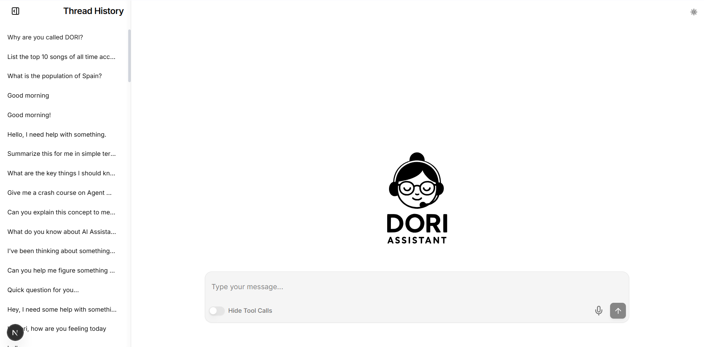
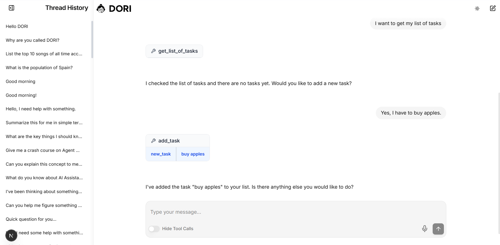

# playAgent

This repository contains the code for the playAgent project, which is designed to develop an AI Agent called DORI, with short and long-term memory capabilities, tool usage, and a user-friendly interface.

The code is an ongoing work in progress.

---

---

---

# Diagrams

https://app.diagrams.net/#G1Th2fe_mDnsKn49gxp0HKeYTBQrXzjUQT#%7B%22pageId%22%3A%2250LRqIvkJEDwD7JDsqcG%22%7D