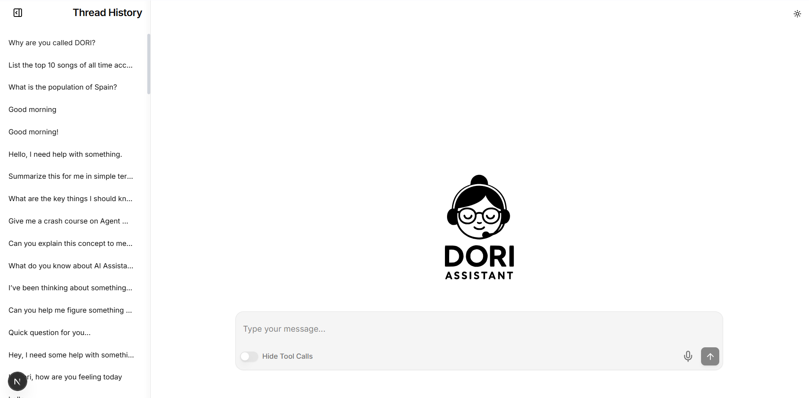
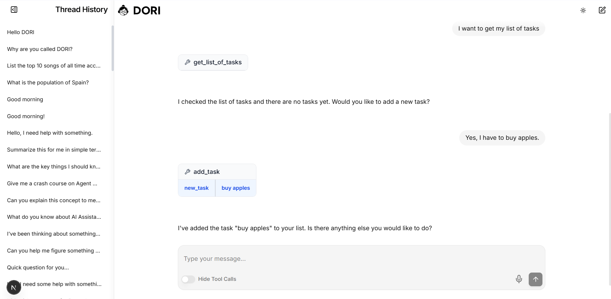

# playAgent

This repository is designed to develop an AI Agent, with short and long-term memory capabilities, tool usage, and a user-friendly interface. 

You can call it DORI!

This repository is an ongoing work in progress.

**Check the Repo wiki for more information: [playAgent Wiki](https://github.com/iriacardiel/playAgent/wiki)**

---

---

## Quick start guide
fist of all, fetch the repo from github with yor desired platform or with code. Then make shure you have `npm` and `uv` correctly installed in your linux or wsl system.

Then, we will proceed with the backend environment preparations:

`cd backend`
`uv sync`

As of this point, you can activate the environment (from root) with:
`source backend/.venv/bin/activate`

And run the server with:
`make dev`

Alternatively (for debugging), you can have front and backend separated in two different terminals with:
`make dev-backend`
`make dev-frontend`

However, make shure yo have your corresponding credentials (in case of using google cloud, add your ApiKey.json in root), and you can configure the model that you want to use in the file backend/.env
In case you don't want to use the audio transcription (or it gives you errors), for now, comment lines 22-45 on file backend/src/services/stt/stt.py